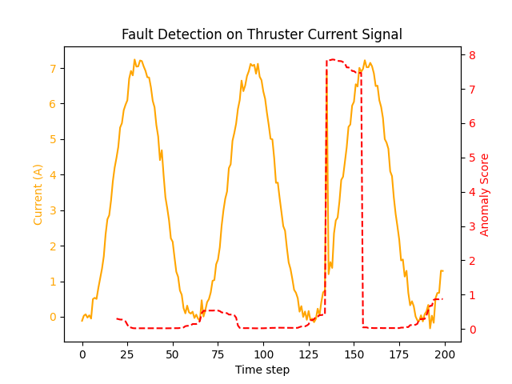

**Overview:**\
This project implements a machine learning–based anomaly detection system for underwater thruster current signals. Using performance data from the Blue Robotics T200 thruster, the system simulates realistic current behavior under normal operating conditions and trains a TensorFlow autoencoder to detect abnormal behavior such as current spikes or overloads.

The model is trained only on normal signals and learns to reconstruct expected current patterns. When abnormal signals occur, the reconstruction error increases, allowing the system to detect potential faults.

**General Pipeline**
PWM Signal Genreation --> Thruster Current Sim --> Fault Injection --> Dataset Generation --> Autoencoder Training --> Anomaly Detection 

Below is an example output of the detector.

- **Orange curve:** simulated thruster current  
- **Red curve:** anomaly score

**Instalation Guidelines:**
  1. git clone https://github.com/yourusername/T200-Fault-Detector.git 
  2. cd T200-Fault-Detector
  3. pip install -r requirements.txt

**How To Run:**
  1. python src/generate_data.py
  2. python src/train_model.py
  3. python src/detect_fault.py
